<div align="center">
  <h1>Paperless-NGX Telegram Concierge</h1>
  <p><strong>A Telegram bot for uploading documents and querying your Paperless-NGX instance directly from Telegram.</strong></p>

  [](https://github.com/mitchins/paperless-ngx-telegram-concierge/actions/workflows/build.yml)
  [](https://sonarcloud.io/summary/new_code?id=mitchins_paperless-concierge)
  [](https://codecov.io/github/mitchins/paperless-ngx-telegram-concierge)
  [](https://www.python.org/downloads/)
  [](https://opensource.org/licenses/MIT)
</div>

## Features

- Document upload via Telegram with real-time processing status
- AI-powered document queries (e.g., "When did I buy that laptop?")
- Phone camera and share sheet integration
- Multi-user support with per-user configurations

## How It Works

```mermaid
flowchart TD
    A[📱 Send photo/document to bot] --> B[🔐 Authorization check]
    B --> C[📤 Upload to Paperless-NGX]
    C --> D[⏱️ Real-time status tracking]
    D --> E{📊 Processing status?}
    E -->|Queued| F[⏳ Waiting for processing...]
    E -->|Processing| G[🔄 Document being processed...]
    E -->|Completed| H[✅ Success! Document indexed]
    E -->|Failed| I[❌ Upload failed]
    H --> J[🤖 Optional AI processing]
    J --> K[🏷️ Smart tags & metadata added]
    F --> D
    G --> D

```



## Setup

1. **Quick Setup**:
   ```bash
   python setup.py
   ```

2. **Configure**:
   ```bash
   cp .env.example .env
   # Edit .env with your tokens and URLs
   ```

   Required settings:
   - `TELEGRAM_BOT_TOKEN` - Get from @BotFather
   - `AUTHORIZED_USERS` - Your Telegram user ID
   - `PAPERLESS_URL` - Your Paperless-NGX instance
   - `PAPERLESS_TOKEN` - Paperless-NGX API token

3. **Get Your User ID**:
   ```bash
   python get_user_id.py
   ```

4. **Run**:
   ```bash
   python bot.py
   ```

## Usage

**Upload Documents**: Send any photo or document file to the bot

**Query Documents**: `/query When did I buy that laptop?`

**Commands**: `/start`, `/help`, `/query <question>`

## Development

```bash
make help         # See all commands
make test         # Run tests
make test-verify  # Verify async test environment
make dev          # Development mode
```

## Troubleshooting

### Async Test Failures

If you see errors like "async def functions are not natively supported":

1. **Verify test environment**:
   ```bash
   python tests/verify_tests.py
   # or
   make test-verify
   ```

2. **Ensure pytest-asyncio is installed**:
   ```bash
   pip install pytest-asyncio
   ```

3. **Check configuration**: The `pyproject.toml` should have:
   ```toml
   [tool.pytest.ini_options]
   asyncio_mode = "auto"
   ```

4. **Remove conflicts**: Delete `pytest.ini` if it exists (conflicts with `pyproject.toml`)

5. **Run tests properly**:
   ```bash
   pytest tests/ -v
   # or
   make test
   ```

## Requirements

- Python 3.8+
- Paperless-NGX instance with API access
- Telegram Bot Token

## License

MIT License
