<div align="center">
  <h1>Paperless-NGX Telegram Concierge</h1>
  <p><strong>A Telegram bot for uploading documents and querying your Paperless-NGX instance directly from Telegram.</strong></p>

  [](https://sonarcloud.io/summary/new_code?id=mitchins_paperless-concierge)
  [](https://codecov.io/gh/mitchins/paperless-concierge)
  [](https://www.python.org/downloads/)
  [](https://opensource.org/licenses/MIT)
</div>

## Features

- Document upload via Telegram with real-time processing status
- AI-powered document queries (e.g., "When did I buy that laptop?")
- Phone camera and share sheet integration
- Multi-user support with per-user configurations

## How It Works

```mermaid
flowchart TD
    A[📱 Send photo/document to bot] --> B[🔐 Authorization check]
    B --> C[📤 Upload to Paperless-NGX]
    C --> D[⏱️ Real-time status tracking]
    D --> E{📊 Processing status?}
    E -->|Queued| F[⏳ Waiting for processing...]
    E -->|Processing| G[🔄 Document being processed...]
    E -->|Completed| H[✅ Success! Document indexed]
    E -->|Failed| I[❌ Upload failed]
    H --> J[🤖 Optional AI processing]
    J --> K[🏷️ Smart tags & metadata added]
    F --> D
    G --> D

```



## Setup

### Docker (Recommended)

1. **Pull the image**:
   ```bash
   docker pull ghcr.io/<YOUR_USERNAME>/paperless-ngx-telegram-concierge:latest
   ```

2. **Add to your Paperless stack** - See [Docker Guide](docs/DOCKER.md) for full integration instructions

3. **Configure environment variables** in your `stack.env`:
   ```bash
   TELEGRAM_BOT_TOKEN=your_bot_token
   AUTHORIZED_USERS=your_telegram_id
   PAPERLESS_URL=http://webserver:8000
   PAPERLESS_TOKEN=your_paperless_token
   ```

### Python Package

1. **Quick Setup**:
   ```bash
   python setup.py
   ```

2. **Configure**:
   ```bash
   cp .env.example .env
   # Edit .env with your tokens and URLs
   ```

   Required settings:
   - `TELEGRAM_BOT_TOKEN` - Get from @BotFather
   - `AUTHORIZED_USERS` - Your Telegram user ID
   - `PAPERLESS_URL` - Your Paperless-NGX instance
   - `PAPERLESS_TOKEN` - Paperless-NGX API token

3. **Get Your User ID**:
   ```bash
   paperless-get-user-id
   # or, without installing the package
   python -m paperless_concierge.cli.get_user_id
   ```

4. **Run**:
   ```bash
   paperless-concierge
   # or, without installing the package
   python -m paperless_concierge.bot
   ```

## Usage

**Upload Documents**: Send any photo or document file to the bot

**Query Documents**: `/query When did I buy that laptop?`

**Commands**: `/start`, `/help`, `/query <question>`

## Development

```bash
make help         # See all commands
make test         # Run tests
make test-verify  # Verify async test environment
make dev          # Development mode
```

## Troubleshooting

For full testing and async troubleshooting guidance, see:

- [Testing & Troubleshooting](docs/TESTING.md)

## Requirements

- Python 3.8+
- Paperless-NGX instance with API access
- Telegram Bot Token

## License

MIT License
